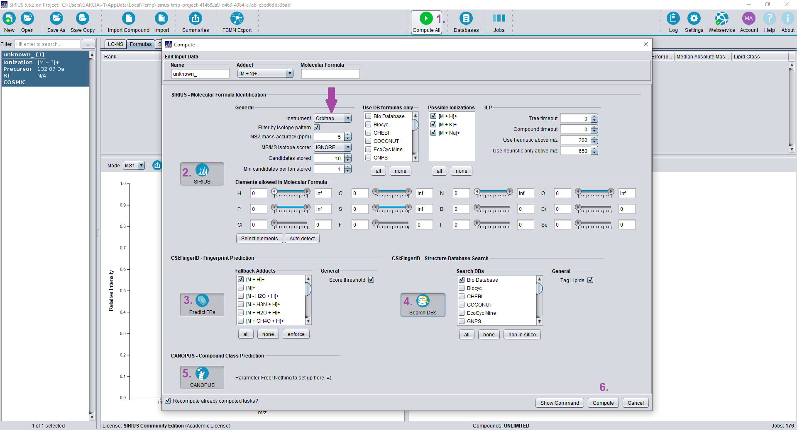

```{r setup, include=FALSE}
knitr::opts_chunk$set(message = FALSE, warning = FALSE)
```


In this document I'm going to focus on the annotation of the compound `hydroxyproline`.  

The chemical standard of `trans-4-Hydroxy-L-proline` was injected together with other analytical standards in positive ESI mode using an Orbitrap mass spectometer.  


# Data Import

First of all I'm going to load the required packages, as well as to import the file.

```{r import}
library(Spectra)
library(MetaboCoreUtils)
library(plotly)

fl <- "C:/Users/garciaalom/Google Drive/projectes/course_wine/data/POS_std/mzML/x012_mix10_1_POS_DDA.mzML"
rdata <- Spectra(fl, source = MsBackendMzR())
table(msLevel(rdata))
```

This file contains spectras of MS level 1 (i.e., full scan), 2 (MS/MS) and 3 (MS$^{3}$).  


# Compound Information

Since the ionisation mode is positive, the main hypothesis is that the main ion is `[M+H]+`, but before looking at how this molecule fragments I will confirm this hypothesis or, if not, I will deduce which is the main ion of this molecule in ESI+.  
Furthermore, it is necessary to know the retention time of this compound.  

For this I will use the data from full scan mode (i.e., MS Level 1). I need the data in `xcms` format. Therefore, I'm going to import again the data using this package.

```{r ms1}
library(xcms)
ms1 <- readMSData(file = fl, msLevel. = 1, mode = "inMemory")
```

Now I have to calculate the m/z value of the `[M+H]+` ion of `hydroxyproline`:

```{r fml}
my_fml <- "C5H9NO3"
my_ad <- "[M+H]+"
my_ms <- calculateMass(my_fml)
(my_mz <- mass2mz(my_ms, adduct = my_ad))
```

I am now going to plot the extract ion chromatogram (EIC) for this m/z value:

```{r chr}
my_chr <- chromatogram(object = ms1, mz = my_mz + 0.01 * c(-1, 1),
                       aggregationFun = "max", msLevel = 1L)
my_chr_df <- data.frame(
  rt = rtime(my_chr[[1]]),
  i = intensity(my_chr[[1]])
)
if(is.na(my_chr_df$i[1])){my_chr_df$i[1] <- 0}
if(is.na(my_chr_df$i[nrow(my_chr_df)])){my_chr_df$i[nrow(my_chr_df)] <- 0}
plot_ly(data = my_chr_df, x = ~rt/60, y = ~i, type = "scatter", mode = "lines",
        line = list(color = "rgba(255, 88, 120,1)", width = 1), 
        name = paste0("<b>Extracted ion chromatogram</b><br> m/z ", 
                      round(my_mz, 4), " (&plusmn; 0.01 Da)"), 
        hoverinfo = "text", text = ~round(rt/60, 2))  %>%
  layout(legend = list(x = 0.7, y = 0.99), showlegend = TRUE, #annotations = annot_max,
         xaxis = list(title = "retention time (min)", showgrid = FALSE, 
                      showticklabels = TRUE, showspikes = TRUE, 
                      spikedash = "solid"), 
         yaxis = list(title = "Counts", zeroline = TRUE, showgrid = FALSE, 
                      showticklabels = TRUE))
```

The retention time of this compound is 0.83 min.  
Now, let's plot the MS spectrum at this time.  

```{r ms1-sps}
my_ms1 <- ms1[which.min(abs(rtime(ms1) - 0.83*60))]
my_ms1_df <- data.frame(
  mz = mz(my_ms1)[[1]],
  i = intensity(my_ms1)[[1]]
)
idx <- order(my_ms1_df$i, decreasing = TRUE)[seq_len(5)]
plot_ly(data = my_ms1_df) %>%
  add_segments(x = ~mz, xend = ~mz, y = 0, yend = ~i, 
               name = paste("<b>MS1 mass spectrum</b><br>MS scan at", 
                            round(rtime(my_ms1)/60, 2), "min"), 
               line = list(color = ~"black", width = 0.8),
               text = ~round(mz, 4), hoverinfo = "text") %>% 
  add_text(data = my_ms1_df[idx,], x = ~mz, y = ~i, text = ~round(mz, 4), 
           textposition = "top", showlegend = FALSE,
           hoverinfo = "text") %>% 
  layout(showlegend = TRUE, legend = list(x = 0.7, y = 0.99), 
         xaxis = list(title = "m/z", autorange = TRUE), 
         yaxis = list(title = "Counts", autorange = TRUE, zeroline = TRUE, 
                      showgrid = FALSE, showticklabels = TRUE))
```


We can confirm that the main ion is the one corresponding to the `[M+H]+` adduct.  


# MS/MS Data

Now that we know that our ion of interest is `132.0655 @ 0.83` we can proceed with the extraction of its MSMS spectrum.   
Since we are interested in MS/MS data, now we can exclude data from MS Level 1.

```{r ms2}
ms2 <- rdata[rdata$msLevel > 1]
```

Below I'm going to search for those MSMS spectra which precursor ion has an m/z value of 132.0655 and it's eluting at 0.83 min: 

```{r ms2sub}
(ms2sub <- filterPrecursorMzRange(ms2, my_mz + 0.1 * c(-1, 1)))
(ms2sub <- filterRt(ms2sub, 0.83*60 + 10 * c(-1, 1)))
```

In this file there is 1 MSMS spectra with our precursor ion of interest eluting at 0.94 min.   

If we check the previous EIC plot we can see that it is within our peak of interest (specifically at the end of the chromatographic peak).  

Let's plot this MSMS spectrum:

```{r ms2-sps}
i <- 1
my_sps_df <- data.frame(
  mz = mz(ms2sub)[[i]],
  i = intensity(ms2sub)[[i]]
)
idx <- which(my_sps_df$i/max(my_sps_df$i) > 0.03)
plot_ly(data = my_sps_df) %>%
  add_segments(x = ~mz, xend = ~mz, y = 0, yend = ~i, 
               name = paste0("<b>MS", msLevel(ms2sub)[i], " ", 
                             round(precursorMz(ms2sub)[i], 4), " @ ", 
                             round(rtime(ms2sub)[i]/60, 2), 
                             " CE ", collisionEnergy(ms2sub)[i], "</b>"), 
               line = list(color = ~"#377EB8", width = 0.8),
               text = ~round(mz, 4), hoverinfo = "text") %>% 
  add_text(data = my_sps_df[idx,], x = ~mz, y = ~i, text = ~round(mz, 4), 
           textposition = "top", showlegend = FALSE,
           hoverinfo = "text", color = I("#377EB8")) %>% 
  layout(showlegend = TRUE, legend = list(x = 0.7, y = 0.99), 
         xaxis = list(title = "m/z", autorange = TRUE), 
         yaxis = list(title = "Counts", autorange = TRUE, zeroline = TRUE, 
                      showgrid = FALSE, showticklabels = TRUE))
```


# Database Queries

```{r queries}
my_sps_df <- my_sps_df[order(my_sps_df$i, decreasing = T),]
my_sps_df[1:3,]
```

We save the MS2 information in a text file and we will use it to query the different databases.

```{r}
write.table(my_sps_df[1:3,], "my_ms2.txt", row.names = F, col.names = F)
```


## MASST

Go to the [MASST website](https://masst.ucsd.edu/) and add the information in the form:  


Notice that the number indicated in the field `Minimum Matched Peaks` has to be lower than the number of reported fragments in the field `Spectrum Peaks` (default = 6).  

Click on the `MASS Molecule` button and wait until the process will finish.  
You'll notice it once the `Status` row of the following page will pass from blue to green and all the rows and squares of the `Progress` row from orange to green:


<br>

To view the quality of the MS/MS match, click `View Mirror Match` to display a mirror plot.


<br>

To see to which compounds of the database our MSMS spectrum is matching click on the item `View All Library Hits`.  


Click the `ViewLib` button of the match of interest and then search the link of the `Metabolomics Spectrum Resolver` to further click on it and see the matched MSMS from the database.


## mzCloud

Go to the [mzCloud Spectrum Search website](https://beta.mzcloud.org/dataviewer#/app/dataviewer/search/spectrum) and add the information in the form and click the button `Search`:


## SIRIUS

Since SIRIUS expects MS and MS/MS spectra as input we need to export the isotopic pattern of this compound from ms1 data.

```{r}
my_ip <- my_ms1_df[c(which.min(abs(my_mz - my_ms1_df$mz)),
                     which.min(abs((my_mz + 1.003355) - my_ms1_df$mz)),
                     which.min(abs((my_mz + 1.003355*2) - my_ms1_df$mz))),]
write.table(my_ip, "my_ms1.txt", row.names = FALSE, col.names = FALSE)
```

Open "SIRIUS" Graphical User Interface (GUI) and click the `Import Compound` button and drag the generated files on the left side of the screen that has just appeared. Then specify which file corresponds to MS1 data and which one to MS2 data. Click `Import`. 


Click `Compute All` and use all available databases.



SIRIUS identifies metabolites in two steps: namely molecular formula annotation and searching in a structure database. 


### Molecular Formula Annotation

Molecular formula annotation is performed considering both the isotopic pattern (MS1 data) and the fragmentation trees (MS2 data).  
Molecular formula annotation results are displayed in the `Formulas` tab and candidates are ranked by the sum of isotope pattern and fragmentation tree score.


### Database Search

After the molecular formula has been identified, the compound is searched in a structure database.   
The results are displayed in the `Structures` tab.   


It is necessary to keep in mind that here the matching is done based on molecular fingerprints not on experimental MSMS data stored in the databases.


