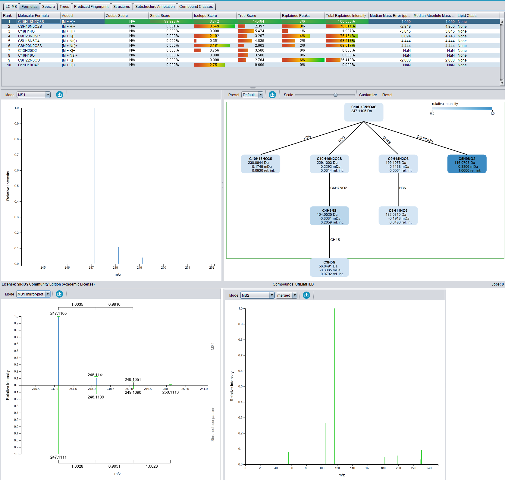
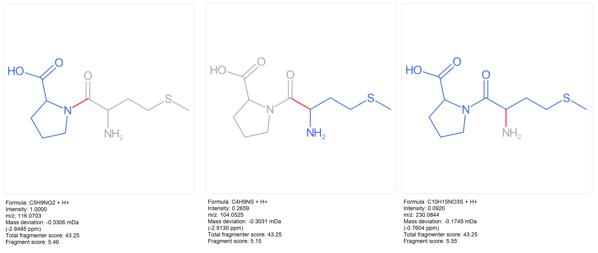
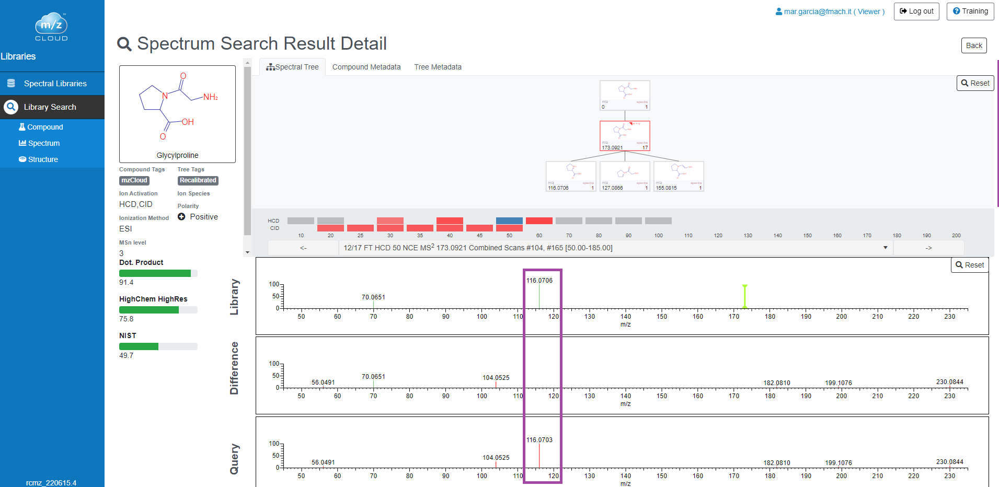
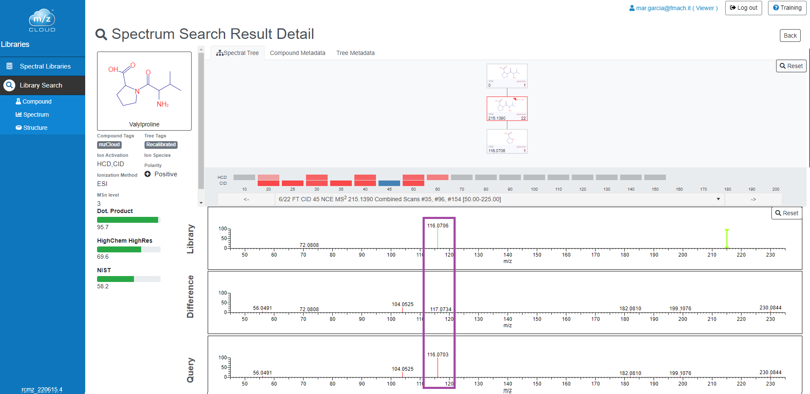

```{r setup, include=FALSE}
knitr::opts_chunk$set(message = FALSE, warning = FALSE)
```

In this second case we are going to use another example from a compound that it is not present in the databases used in the [Example 1](), at least on November 2022 (i.e., [mzCloud](https://beta.mzcloud.org/dataviewer#/app/dataviewer/library/hPqDettnTP) and [GNPS](https://gnps-library.ucsd.edu/)).  
This compound is the dipeptide `Met-Pro` and our ion of interest is `247.1111 @ 2.51` (see `Annex` section for specific details).


# Data Import

```{r}
library(Spectra)
library(MetaboCoreUtils)

fl <- "C:/Users/garciaalom/Google Drive/projectes/course_wine/data/POS_std/mzML/x013_mix11_1_POS_DDA.mzML"
rdata <- Spectra(fl, source = MsBackendMzR())

ms1 <- rdata[rdata$msLevel == 1]
my_ms1 <- ms1[which.min(abs(2.51*60 - rtime(ms1)))]
my_ms1_df <- data.frame(
  mz = mz(my_ms1)[[1]],
  i = intensity(my_ms1)[[1]]
)

my_fml <- "C10H18N2O3S"
my_ad <- "[M+H]+"
my_ms <- calculateMass(my_fml)
my_mz <- mass2mz(my_ms, adduct = my_ad)

my_ip <- my_ms1_df[c(which.min(abs(my_mz - my_ms1_df$mz)),
                     which.min(abs((my_mz + 1.003355) - my_ms1_df$mz)),
                     which.min(abs((my_mz + 1.003355*2) - my_ms1_df$mz))),]
write.table(my_ip, "my_ms1.txt", row.names = FALSE, col.names = FALSE)

ms2 <- rdata[rdata$msLevel > 1]
ms2sub <- filterPrecursorMzRange(ms2, my_mz + 0.1 * c(-1, 1))
i <- which.min(abs(2.51*60 - rtime(ms2sub)))
my_sps_df <- data.frame(
  mz = mz(ms2sub)[[i]],
  i = intensity(ms2sub)[[i]]
)
my_sps_df <- my_sps_df[order(my_sps_df$i, decreasing = T),]
write.table(my_sps_df[1:7,], "my_ms2.txt", row.names = F, col.names = F)
```


# SIRIUS

First of all I'm going to use the SIRIUS software since it is more based on theoretical rules and compounds present in databases independently of MS/MS availability. 



<br>


<br>



# mzCloud

[mzCloud](https://beta.mzcloud.org/dataviewer#/app/dataviewer/search/spectrum) is a database that also allows extract potential interesting information from the MS/MS spectrum even if it comes from a compound that is not present in this database through the use of the `Substrcture Search`.  
`Substrcture Search` aims to find compounds that contain particular fragments probably related with specific structural moieties.

In this case it is necessary to use the `Algorithm Type = Similarity`:  


First results correspond to proline-containing molecules:  




<br> 



# Annex

## Compound information

### Extracted ion chromatogram

```{r eic}
library(xcms)
library(plotly)

ms1 <- readMSData(file = fl, msLevel. = 1, mode = "inMemory")
my_chr <- chromatogram(object = ms1, mz = my_mz + 0.01 * c(-1, 1),
                       aggregationFun = "max", msLevel = 1L)
my_chr_df <- data.frame(
  rt = rtime(my_chr[[1]]),
  i = intensity(my_chr[[1]])
)
if(is.na(my_chr_df$i[1])){my_chr_df$i[1] <- 0}
if(is.na(my_chr_df$i[nrow(my_chr_df)])){my_chr_df$i[nrow(my_chr_df)] <- 0}
plot_ly(data = my_chr_df, x = ~rt/60, y = ~i, type = "scatter", mode = "lines",
        line = list(color = "rgba(255, 88, 120,1)", width = 1), 
        name = paste0("<b>Extracted ion chromatogram</b><br> m/z ", 
                      round(my_mz, 4), " (&plusmn; 0.01 Da)"), 
        hoverinfo = "text", text = ~round(rt/60, 2))  %>%
  layout(legend = list(x = 0.7, y = 0.99), showlegend = TRUE, #annotations = annot_max,
         xaxis = list(title = "retention time (min)", showgrid = FALSE, 
                      showticklabels = TRUE, showspikes = TRUE, 
                      spikedash = "solid"), 
         yaxis = list(title = "Counts", zeroline = TRUE, showgrid = FALSE, 
                      showticklabels = TRUE))
```


### MS/MS data

```{r ms2}
idx <- which(my_sps_df$i/max(my_sps_df$i) > 0.05)
plot_ly(data = my_sps_df) %>%
  add_segments(x = ~mz, xend = ~mz, y = 0, yend = ~i, 
               name = paste0("<b>MS", msLevel(ms2sub)[i], " ", 
                             round(precursorMz(ms2sub)[i], 4), " @ ", 
                             round(rtime(ms2sub)[i]/60, 2), 
                             " CE ", collisionEnergy(ms2sub)[i], "</b>"), 
               line = list(color = ~"#377EB8", width = 0.8),
               text = ~round(mz, 4), hoverinfo = "text") %>% 
  add_text(data = my_sps_df[idx,], x = ~mz, y = ~i, text = ~round(mz, 4), 
           textposition = "top", showlegend = FALSE,
           hoverinfo = "text", color = I("#377EB8")) %>% 
  layout(showlegend = TRUE, legend = list(x = 0.7, y = 0.99), 
         xaxis = list(title = "m/z", autorange = TRUE), 
         yaxis = list(title = "Counts", autorange = TRUE, zeroline = TRUE, 
                      showgrid = FALSE, showticklabels = TRUE))
```
