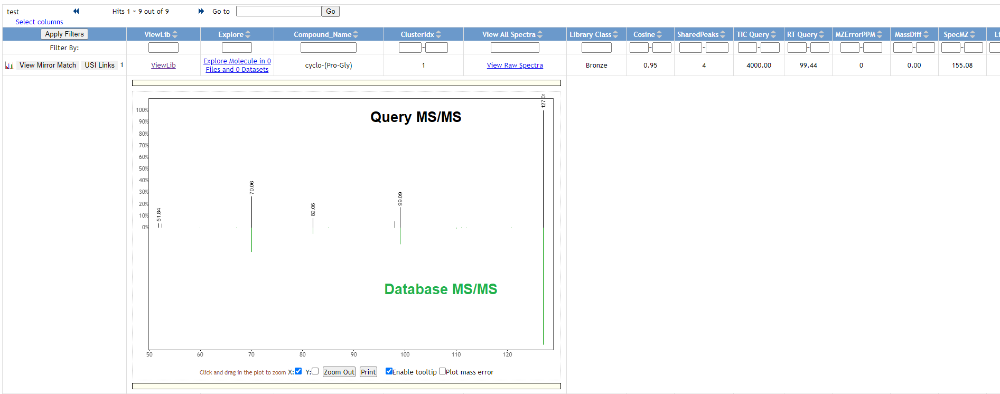
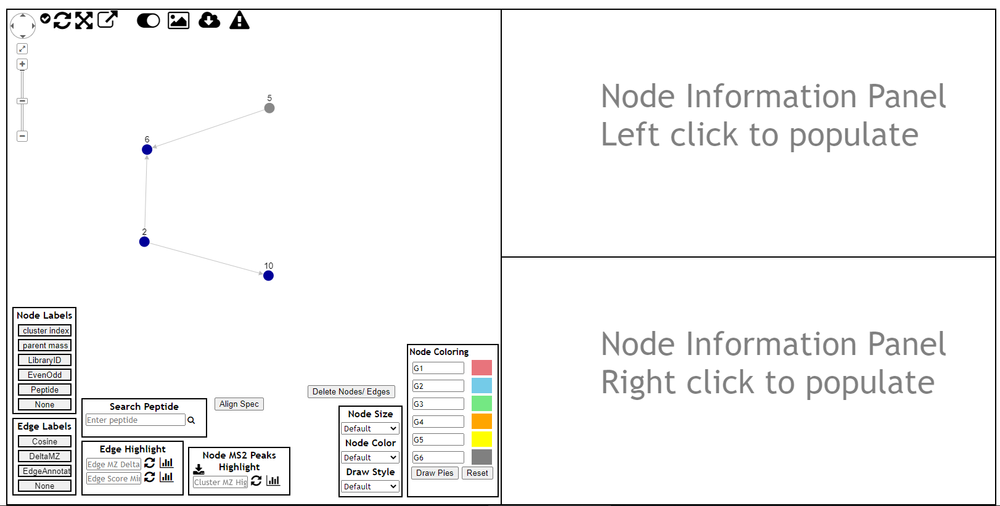
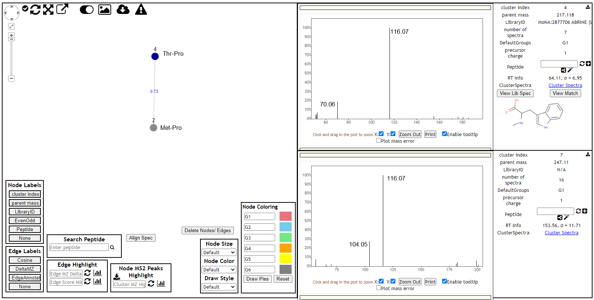

```{r setup, include=FALSE}
knitr::opts_chunk$set(message = FALSE, warning = FALSE)
```

In this document we are going to apply the `Molecular Networking` tool of [GNPS platform](https://gnps.ucsd.edu/) to visualizate the chemical space present in MS/MS experiments.   
The idea is to detect if there are related molecules (molecular networks) between the acquired MSMS spectras.  
<br>  
For that I'm going to start with an "easy example".   
That is, I'm going to use a series of DDA experiments in which we analysed different chemical standards (i.e., known compounds) diluted in water, knowing that some of them share some fragment ions.  
The method was set up to fragment the X most intensive ions per scan, using the dynamic exclusion list to avoid more than Y MS/MS of the same precursor ion within a time window of Z seconds.  
Since this approach yields a large number of MS/MS fragments of background ions, I will first focus on those MS/MS spectra whose precursor ion corresponds to one of the standards used.  

# Data setup

Therefore, first of all I'm going to calculate the m/z values of the main ions associated with each compound included in these mix of standards:  

```{r}
library(MetaboCoreUtils)
std <- readxl::read_xlsx("C:/Users/garciaalom/Google Drive/projectes/course_wine/data/Std mix.xlsx")
std <- std[std$adduct_POS != "NA",]
my_mz <- rep(NA, nrow(std))
for(i in seq(nrow(std))){
  my_mz[i] <- mass2mz(calculateMass(std$formula[i]), std$adduct_POS[i])
}
```

Here, I'm going to import all files obtained from the injection of this standard mixtures,  I'll select the MS/MS spectra of interest and I'll export the obtained object of spectras in a new mzML file:

```{r}
library(Spectra)
library(MsCoreUtils)
fls <- list.files("C:/Users/garciaalom/Google Drive/projectes/course_wine/data/POS_std/mzML/", 
                  full.names = T)
fls <- fls[grep("mix", fls)]
fls <- fls[!grepl("HR", fls)]

rdata <- Spectra(fls, source = MsBackendMzR())
ms2 <- rdata[rdata$msLevel > 1]
idx <- c()
for(i in seq(length(my_mz))){
  idx <- c(idx, which(between(precursorMz(ms2), my_mz[i] + 0.01 * c(-1, 1))))
}
idx <- unique(idx)
ms2x <- ms2[idx]
export(ms2x, backend = MsBackendMzR(), format = "mzML", 
             file = "std_POS_ms2.mzML", 
             copy = TRUE)
```


# GNPS workflow submission

And now it's time to the [main GNPS page](https://gnps.ucsd.edu/) and click the `Create Molecular Network` button.


This will bring us to the workflow input to start networking.

  

It is necessary to provide a title:


and select the files for analysis by first clicking "Select Input Files":


This bring a popup window where we can select the files to analyze:


Then there are different parameters that we can set up.   
Below I'm going to comment some of them:  
  
  - **Precursor Ion Mass Tolerance:** value used to join nearly-identical MS/MS spectra via MS-Cluster. It is recommended to use a ± 0.03 Da value for data acquired with for high resolution mass spectrometers and studies focused on small-molecules (i.e., m/z range up to 2000 Da)  
  - **Fragment Ion Mass Tolerance:** value used to specify how much fragment ions can be shifted from their expected m/z values. Recommended value is ± 0.02 Da for high-resolution instruments.  
  - **Minimum Matched Fragment Ions:** minimum number of common fragment ions that are shared by two separate consensus MS/MS spectra in order to be connected by an edge in the molecular network.  
  - **Library Search Min Matched Peaks:** Minimum number of common fragment ions that MS/MS spectra should contain in order to be considered for spectral library annotation  


Upon submission of the workflow, we will be brought to the status page. This will show us the progress of your molecular networking job.


# Results exploration

[output current example](https://gnps.ucsd.edu/ProteoSAFe/status.jsp?task=ef03cfa3120e461daad1076691940530)  
[version 2](http://gnps.ucsd.edu/ProteoSAFe/status.jsp?task=63493ffc2be4422fa1dfef310e718310)

## View All Library Hits

This view shows all the library matches between the consensus MS/MS spectra and the GNPS MS/MS Spectral Libraries.


To view the quality of the MS/MS match, click "View Mirror Match" to display a mirror plot



## View Spectral Families

This allows us to see all the distinct spectral families that comprise the entire molecular network. 


To visualize each network, click on the "Visualize Network" link.  

### Network 1

This brings up an in-browser visualization for a given spectral family



Here we can explore the specific spectral family in the molecular network.   
Each circle (node) in the left network panel represents a consensus spectrum and edge represents related fragmentation patterns.   
The default color of the nodes is gray, with blue nodes representing consensus MS/MS spectra that were identified by library search.


### Network 2


